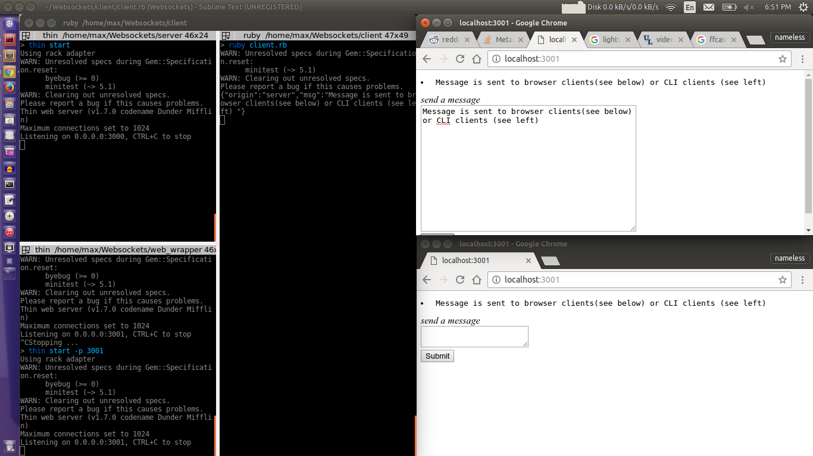

I don't really expect this to gain actual usage. It's more of me practicing building and amassing a library of components
I can use in the future. 

Specifically, this project concerns websockets and a browser wrapper for the CLI.

- "server" is the base websocket server.
From this was extracted the generator gem [sinatra_sockets](http://github.com/maxpleaner/sinatra_sockets).
Note that this is obviously not an app with Rails-like complexity. It's pretty much just well-organized boiler plate for
getting started with websockets on sinatra. It uses `faye-websockets` which uses `eventmachine`. It's currently
just configured to echo whatever message it receives (like a basic chat room). 

- "client" connects to "server" over websockets. It is an interactive script that waits for user input, then
forwards the string to the server. It also listens for server messages on a background thread, and prints any messages
that are received.

- "web wrapper" uses `PTY.spawn` to wrap "client". It has a websocket server that is separate from the base "server" (it only
concerns websocket connections with browser-based clients. It has a UI which allows for entering a new message and it prints
all received message.

In terms of a broad outline it's `server => client => web wrapper`. If you are wondering what the point of "client" is here,
you're not wrong. "web wrapper" could actually be the client. But I felt like writing it this way, so I did. 

Usage:

```txt
git clone http://github.com/maxpleaner/chatterer
cd chatterer
bundle install

# in a new terminal
cd server
thin start

# in another new terminal
cd web_wrapper
thin start -p 3001
```

Then visit `localhost:3001` in the browser. You should be able to type messages and see them appear in the chat box.


